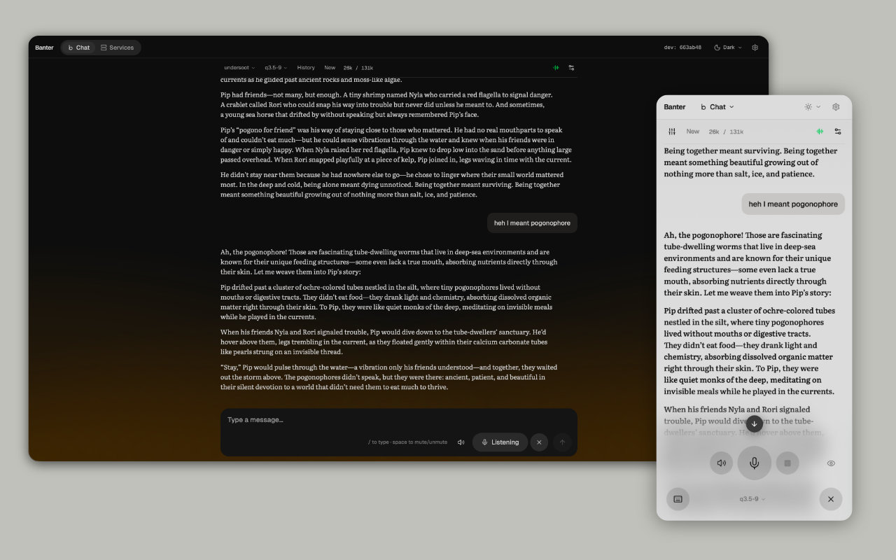

# Banter

A conversational voice interface for agent harnesses, using fully private & self-hosted transcription and speech services of your choice.

It hears when you have actually meant to finish speaking, cleans your speech of fillers, replies as the words are written, and lets you cut in mid-sentence. A control plane starts the speech models when a conversation needs them and unloads them when it does not, across as many machines as you point it at.

Built against [OpenClaw](https://docs.openclaw.ai/), and adaptable to other agent harnesses.

Published as-is; not actively maintained; no support implied. Apache-2.0. Built with [Claude Code](https://claude.com/claude-code). Most of the code was written by a model, directed and reviewed by me. Use at your own risk.



## What it does

**Banter is designed to have fast, natural-feeling conversations, with zero effort. Speech quality is defined by the speech models you choose to run / can afford, and can be run entirely off private models hosted anywhere.**

### Features

**Thoughtful turn-taking.** Most voice interfaces wait a fixed number of milliseconds for silence, so pausing to think cuts you off. Banter runs two ONNX models in the browser: Silero VAD decides when you are speaking, and pipecat's smart-turn decides whether you have finished a thought or merely paused. "I was thinking that…" and "I was thinking that." get different treatment. The reply streams back as audio while it is still being generated, and talking over it cuts the playback and starts a new turn. All this is tunable via `config.json`

**Simultaneous text chat.** Message history, streaming responses, tool calls as expandable cards, and a session list for switching between conversations. Voice is one input mode on that page; turn it off and an ordinary text client remains. There are limitations: it is not a full replacement for a text chat, and doesn't include features like steering, response queues, or file attachments/uploads. The UI is tuned to be a voice-first interface. Unlike the Discord integrations, you get simultaneous voice and text chats, with the ability to use text mid-conversation.

**Full control over your speech and text data.** You install the speech-to-text and text-to-speech servers yourself, and the registry points at them by address, so your audio only ever reaches machines you run. The VAD and turn-detection models download once, verified against pinned SHA-256 hashes, and run in the browser from then on. You can send your audio anywhere, including ElevenLabs or OpenAI's transcription services, but Banter is built on a model where you never need to.

**Tightly contained architecture**: one single port is the access point, and each shard runs off a single port too. Banter does not attempt to solve security, leaving it up to much more mature mechanisms in harnesses and remote network access products. Dependencies are small, and you are free to install whichever speech and transcription services you choose.

**Services start when needed and unload when idle.** A registered service can be demand-loaded: started on first use, health-checked until ready, evicted after a timeout. One machine can then host more models than it has memory to run at once. The services page shows health for everything registered, with manual start and stop.

**Services can live anywhere.** A service is a registry entry with an address and a health path; the registry has no notion of what the service does. It can run on the same box, on another machine, or under something you manage yourself. Runners cover spawning a process, driving systemd or launchd, delegating to a service's own CLI, and health-checking something already running. Speech models are what this was built for, and anything answering HTTP can be registered alongside them.

**Nothing to install on client devices.** The dashboard ships a web manifest, so it can be saved to a phone's home screen and run standalone. An unattended mode enables a screen lock for hands-free use on phones.

## Architecture

- **Control plane** — the always-on process. Serves the dashboard, holds the registry of every known service and host, runs periodic health checks, and exposes the API the dashboard uses.
- **Dashboard** — a React SPA served by the control plane. Two pages: chat (the root route) and services. The whole voice pipeline runs here, in the browser.
- **Control shard** (optional) — a full second control plane on a worker machine, so services can live on hardware that suits them. See [docs/shard-setup.md](docs/shard-setup.md).
- **`services/`** — adapter servers that put an OpenAI-compatible API in front of the speech models: whisper and fluid-audio for speech-to-text, kokoro, neutts-air and mlx-voxtral-swift for text-to-speech. Nothing installs itself; you build each one and point a registry entry at it. See [docs/models.md](docs/models.md) for which to pick and [services/README.md](services/README.md) for how to build them.
- **`plugins/voice-mode/`** — installs into your OpenClaw gateway and tells the agent it is being spoken to rather than read, so it answers in a way that works out loud.
- **`scripts/`** — install, deploy, and diagnostic scripts for running the control plane (and shards) as a system service, plus a few standalone tools like driving a service by hand when the API is unavailable. None of it is required for local development. See [scripts/README.md](scripts/README.md) for the index.

[docs/architecture/](docs/architecture/README.md) has the full picture — how a voice turn works end to end, and why the control plane exists at all.

**Networking.** Any network where the machines can reach each other will do — nothing is required for control plane–shard connectivity or for reaching services. Endpoints default to plain `http`; set `scheme: "https"` per service or registry-wide when something terminates TLS, whether that's a reverse proxy, your own cert, or Tailscale Serve.

If you want the dashboard on your phone while away from home, you need some way in from outside your network. [Tailscale](https://tailscale.com/) is one answer and the one Banter already knows about — set `tailscaleServe` on a service and it registers with `tailscale serve` on start, giving you an HTTPS address on your tailnet without opening a port to the internet. See [docs/remote-access.md](docs/remote-access.md) for the actual steps. Any other remote-access approach works too; Banter simply has no built-in support for it.

## Install

Banter is one machine, plus as many more as you want. The **control plane** serves the API and dashboard and is always needed. **Shards** are optional: each runs model services on another machine, and the control plane polls all of them and presents their services as one pool. Nothing caps the number — the registry takes a list of hosts.

Running everything on one machine is fine. Shards exist so each service can run on whatever hardware suits it while the control plane runs elsewhere, most likely on the same machine as your agent harness.

The steps below are shared by every OS; the only part that differs is how the control plane is kept running, which is the **Install as a service** section.

### Prerequisites

- **[Bun](https://bun.sh)** — the runtime for everything here. Developed against 1.3.x.
- **`jq`** — used by `control-runner.sh` to read the port out of the registry.
- **`lsof`** — used by a few scripts to find or free a port. Not installed by default on minimal distros (Debian netinst, Alpine, most containers); everything else here is usually already present.
- A way to reach the dashboard from your phone when you are **away from your home network**, if you want that. Banter only needs endpoints it can reach, however you arrange that; [Tailscale](https://tailscale.com) is the one it has built-in support for — see **Networking** above. On your own network a LAN address is enough.
- An **[OpenClaw](https://github.com/openclaw/openclaw) gateway** to talk to.

Speech models bring their own prerequisites — Python 3 with `venv` for the Python adapters, a Swift toolchain only if you build the Swift ones — covered in **Choose and install speech models** below, since nothing up to that point needs either.

### Clone it

```bash
git clone https://github.com/arvindvenkataramani/banter.git
cd banter
```

### Fast path: `scripts/install.sh`

Everything from here through a running, reachable control plane — dependencies, model assets, config, and installing it as a service on Linux or macOS — in one script. It prompts for your OpenClaw gateway URL and token (or read them from `OPENCLAW_GATEWAY_URL`/`OPENCLAW_GATEWAY_TOKEN` for a non-interactive run) and leaves `registry.json` at its shipped defaults, since the control plane itself needs no speech services to start.

```bash
scripts/install.sh
```

When it finishes, skip ahead to **Choose and install speech models** below. The rest of this section is the same steps by hand, for anything the script doesn't cover for your setup or if something goes wrong and you want to see where.

### Set up the control plane

Run these on the control-plane machine.

```bash
bun install
```

The browser's VAD and turn-detection model assets are committed to the repo, so
there is nothing to download here. `cd dashboard && bun run setup` re-verifies
them against their pinned hashes if you ever need to.

### Configure it

Create the two config files:

```bash
cp control/control-plane/data/registry.example.json control/control-plane/data/registry.json
cp control/control-plane/data/config.example.json    control/control-plane/data/config.json
```

Edit `config.json` to point at your OpenClaw gateway (`integrations.openclaw.gateway.url` and `token`). The example `registry.json` is enough to get the control plane itself running — leave it as-is for now; speech services come after the control plane is up. [docs/configuration.md](docs/configuration.md) covers the minimum needed and how to add more.

The token may be written as `"${OPENCLAW_GATEWAY_TOKEN}"` rather than pasted in, in which case it is read from the environment at the point of use. Note the deployed service does not yet load an environment file, so a placeholder there resolves to nothing and the gateway goes unauthenticated — paste the value for a deployed run. `control-dev` does read `$BANTER_PROD/.env.secrets`, which lives outside the repo.

### Install as a service

This is the only step that differs by OS.

#### Linux with systemd

The path this is developed and run on.

```bash
loginctl enable-linger $USER   # once per machine: keeps the service running
                               # when you are not logged in
scripts/control-deploy.sh
```

`control-deploy.sh` builds the dashboard, installs a systemd **user** unit, and starts it. Afterwards `scripts/control-start.sh` and `control-stop.sh` control it, and re-running `control-deploy.sh` picks up code changes.

#### macOS, or Linux without systemd

Untested. I run the control plane on Linux, so this path is what the scripts say should happen rather than something I have done. The deployed tree is a plain directory and starts from one script, so the fallback below is sound, but expect to work out the supervisor part yourself.

`control-deploy.sh` builds, copies, and installs dependencies portably, then calls `systemctl --user` to register and start the unit. Without systemd it should fail there — inside `control-install-services.sh`, after the deployed tree is complete and before any service is registered. So let it run, then supervise the result yourself:

```bash
scripts/control-deploy.sh || true   # expected to fail at the systemd step
~/services/banter/scripts/control-runner.sh   # foreground, to check it serves
```

`control-runner.sh` reads the port from the registry, registers with Tailscale Serve if you have it (skipped silently otherwise), and execs bun. Ctrl+C to stop it. To keep it running, point a supervisor at that script — a launchd agent on macOS, or whatever you use. It needs `BANTER_PROD` set in its environment if you deployed anywhere other than `~/services/banter`.

`ops/systemd/banter.service.template` is the systemd unit before rendering — `__PROD__` and `__UNIT__` are substituted at install time. It is a useful reference for what a launchd plist needs to do.

#### Windows

I don't have a Windows machine, so I have no idea what it would take to run Banter there and no interest in finding out. Nothing below is advice — it is just what the code obviously implies.

Every script here is bash calling `systemctl`, `loginctl`, and `lsof`, so native Windows is not going to work without replacing all of that. WSL2 with systemd enabled (`systemd=true` in `/etc/wsl.conf`) is Linux with systemd, so the path above ought to apply. Whether it does, I couldn't tell you.

Reaching the dashboard from Windows is a different question and a much duller one: it is served over HTTP to a browser, so the client can be any OS no matter where the control plane runs.

### Where it installs

The deploy tree defaults to `~/services/banter` and is a **copy** — the repo is the source, that tree is what runs. Settings changed from the dashboard are written there, and a later deploy preserves them rather than overwriting with the repo's copies.

To install somewhere else, set it once in a config file:

```bash
cp scripts/deploy.conf.example scripts/deploy.conf
```

Uncomment `BANTER_PROD` and `BANTER_UNIT` there and every script picks them up — deploy, start, stop, uninstall. `deploy.conf` is untracked, so the setting is yours and survives every deploy. Set both together: a second install on one machine needs its own directory *and* its own unit name, or `systemctl --user restart banter` acts on whichever one holds the name. Passing only one is refused rather than half-applied.

[scripts/README.md](scripts/README.md) indexes the rest, including `service-control.sh` for driving services by hand when the control API is not available.

### Uninstalling

```bash
scripts/control-uninstall.sh
```

Reverses exactly what `control-deploy.sh` installed: tears down the Tailscale Serve binding, stops and removes the systemd unit (or, on the macOS fallback path, stops the running `control-runner.sh` process directly — there is no unit there to remove), and deletes the deployed tree at `$BANTER_PROD`. `scripts/shard-uninstall.sh` does the same for a shard. Run `control-deploy.sh` again afterward to reinstall.

## Connect your speech servers

**Voice needs two servers you provide yourself:** one speech-to-text, one
text-to-speech. Banter never installs, builds, or downloads them — it reads your
config, checks they are healthy, and sends them audio and text. Until both are
connected, the dashboard works for typing but voice does nothing.

Run them however you like: Docker, a venv, a systemd unit, another machine on
your network. Banter only needs a URL and a health path. Any server works if it
meets the contract in step 1 — [docs/models.md](docs/models.md) has known-working
options if you don't already have a preference.

### 1. Check your servers qualify

Any OpenAI-compatible speech server works: `POST /v1/audio/transcriptions` for
STT, `POST /v1/audio/speech` plus `POST`/`DELETE /v1/models` for TTS, and a
health path on each. They also need CORS, since the browser calls them directly
— that is the usual reason a healthy-looking server fails. Check with:

```bash
curl -si -X OPTIONS http://YOUR-SERVER/v1/audio/speech \
  -H 'Origin: http://localhost:4200' \
  -H 'Access-Control-Request-Method: POST' | grep -i allow-origin
```

An `access-control-allow-origin` line back means you are set. Nothing back means
the browser will refuse the server even though `curl` reaches it — set the
allowed origin on the server itself, using whatever address you open the
dashboard at.

### 2. Add them to `registry.json`

Both entries go in the `services` array. `"runner": { "type": "external" }` means
Banter only watches the service — it never tries to start, stop, or restart it.
That is the simplest setup and the one to use unless you want Banter managing
the process.

```json
"services": [
  {
    "id": "stt-mine",
    "name": "My STT",
    "capabilityId": "stt",
    "hostId": "box",
    "permissions": { "enabled": true, "protected": false },
    "runner": { "type": "external" },
    "network": { "port": 8765, "healthPath": "/healthz" }
  },
  {
    "id": "tts-mine",
    "name": "My TTS",
    "capabilityId": "tts",
    "hostId": "box",
    "permissions": { "enabled": true, "protected": false },
    "runner": { "type": "external" },
    "network": { "port": 8002, "healthPath": "/health" }
  }
]
```

The two differ only in `id`, `name`, `capabilityId`, and `network`. Set `hostId`
to match an entry in your `hosts` array (`box` above is an example), and set each
`port` and `healthPath` to your own server's. If a server is reached over HTTPS,
add `"scheme": "https"` inside its `network` block.

### 3. Point the voice config at them

The `voice` block in `config.json`, with both halves filled in. The `serviceId`
values must match the `id` values you just used in the registry:

```json
"voice": {
  "enabled": true,
  "stt": { "serviceId": "stt-mine" },
  "tts": {
    "providers": [
      {
        "serviceId": "tts-mine",
        "name": "My TTS",
        "models": [
          {
            "id": "MODEL-ID",
            "name": "My Model",
            "voices": [{ "id": "VOICE-ID", "name": "Voice" }]
          }
        ]
      }
    ],
    "selection": { "serviceId": "tts-mine", "model": "MODEL-ID", "voice": "VOICE-ID" }
  }
}
```

STT needs only the service id. TTS needs the catalogue too: the settings dialog
offers exactly what `providers` lists, so a model missing from it cannot be
selected however well the server runs, and `selection` is what gets used until
you change it in the dialog.

`MODEL-ID` and `VOICE-ID` are passed to your server verbatim, so they must be
values it accepts. The `name` fields are only labels for the dialog.

### 4. Restart and check

`registry.json` is read only at startup, so a registry change needs a restart:
`control-stop.sh` then `control-start.sh` (`shard-*` on a shard, or Ctrl+C and
rerun `control-runner.sh` on the macOS fallback path). `config.json` reloads live
via `POST /api/config/reload` — no restart.

Both services should show online in the dashboard. If voice still fails while
they look healthy, it is almost always CORS — recheck step 1.

> Want suggestions for what to run? [docs/models.md](docs/models.md) covers
> known-working options per platform, and [services/](services/) has adapter code
> for several. Neither is required: any server meeting the contract above works.

## iOS / mobile use

Voice works on iPhone and iPad, but iOS Safari's autoplay restrictions can make playback silently fail to start in a way that's easy to mistake for a bug.


- **Playback is iOS gated by iOS on user interaction**, and it isn't satisfied by just turning on voice mode or granting mic access.
- **What resolves it is interacting with something else on the page** — tapping a button, sending a message via text, etc. — after voice mode is on. That interaction is what convinces Safari to let audio playback through. It should work fine after that. I haven't figured out any clear rules on how long-lived this permission is, so it may reset between sessions.
- If replies seem to arrive with no audio, interact with some other part of the UI once; that's not a workaround, it's expected behavior on iOS Safari.
- I don't have an Android or Windows device so I can't tell you what will be like.

## Adding shards (optional)

**What a shard is.** A second control plane, running on another machine and managing that machine's services. The primary polls it and merges what it finds, so the dashboard shows one pool of services regardless of which box each one lives on.

It exists because a control plane can only start processes on its own host. Registering a service on another machine is enough to *health-check* it, but not to start or stop it — something has to be running there to do that, and a shard is that something.

**Why you might want one.** To run each service on the machine that suits it. Nothing about a service has to be speech-related: the registry has no notion of what a service does, only how to start it and how to tell whether it is healthy. Anything with an HTTP endpoint and a health path can be registered and controlled the same way.

That puts the heavy work on a GPU box, a Mac with a Neural Engine, a NAS, or a machine that is only sometimes on, while the control plane stays somewhere small and always-on. A shard also brings idle eviction, which the primary does not have: services start on first use and unload after a timeout, so one machine can host more than it has memory to run at once.

If one machine is doing everything adequately, you do not need this.

**Adding one.** `scripts/shard-deploy.sh` installs a shard on macOS; there is no Linux equivalent yet. Then add the machine as a host in the primary's registry and move that machine's service entries to it. Repeat per machine — nothing caps how many.

See [docs/shard-setup.md](docs/shard-setup.md) for the full walkthrough.

## Plugin install

Banter ships an OpenClaw plugin that injects voice-specific guidance into the system prompt, so the agent knows it is being spoken to rather than read.

```bash
cd plugins/voice-mode
bun install && bun run build
openclaw plugins install .
```

Build first: OpenClaw loads `dist/index.js`, so an unbuilt plugin installs and does nothing. Point the install at the directory, not the file — the entry point comes from `package.json`.

Set `sessionKeyPrefix` in the plugin's config to `agent:<your-agent-id>:` — session keys are `agent:<agent-id>:<session>`, and the agent id comes from your gateway. The shipped default is a placeholder and will not match anything.

`openclaw plugins list` shows it as enabled once installed.

## Documentation

- [docs/models.md](docs/models.md) — which speech models to run, and what each needs
- [docs/configuration.md](docs/configuration.md) — the minimum config, adding services, adding a shard
- [docs/shard-setup.md](docs/shard-setup.md) — adding shards on other machines
- [docs/remote-access.md](docs/remote-access.md) — reaching the dashboard from outside your network with Tailscale
- [docs/architecture/](docs/architecture/README.md) — how the system works
- [docs/gateway/](docs/gateway/) — the OpenClaw wire protocol, and the starting point for adapting this to a different agent harness
- [docs/api-reference.md](docs/api-reference.md) — generated HTTP API reference
- [scripts/README.md](scripts/README.md) — deployment, lifecycle, and diagnostic scripts

## Requirements and constraints

- STT/TTS servers must be OpenAI-compatible (`/v1/audio/speech`-shaped for TTS) and CORS-enabled — the browser calls them cross-origin from the dashboard's own origin.
- `onnxruntime-web` is pinned to `1.18.0`. Versions ≥1.19 drop single-threaded WASM and require cross-origin isolation headers (`COOP`/`COEP`) this stack doesn't set. The `onnxruntime-web/experimental` bundle (`ort.all`) is required for the quantized operators smart-turn's model uses — the default import omits `QuantizeLinear`/`DequantizeLinear`.
- The browser's model assets (~10MB) are committed to this repo, so a clone needs no download step for them: [Silero VAD](https://github.com/snakers4/silero-vad) (MIT), [pipecat smart-turn](https://huggingface.co/pipecat-ai/smart-turn-v3) (BSD-2-Clause), and [openai/whisper-tiny](https://huggingface.co/openai/whisper-tiny) (Apache-2.0, used only for its preprocessor config) — see NOTICE. Each is pinned by SHA-256 in `dashboard/scripts/fetch-models.ts`; `cd dashboard && bun run setup` re-verifies them against those pins and re-fetches if one is missing. This does not apply to the speech models themselves, which are large and download on first run.
- `parakeet-mlx-fastapi` (a pip-installable STT option) and `services/stt/whisper` (this repo's own adapter) offer the same API shape — see [models.md](docs/models.md#speech-to-text-models-recommended) for the tradeoffs between them.

## Hardening

This ships with sane defaults for local/Tailscale use. A few things worth knowing before exposing it beyond your own machine:

- **Unauthenticated gateway on a bare deploy.** If `integrations.openclaw.gateway.token` is left as `"${OPENCLAW_GATEWAY_TOKEN}"` and the deployed service has no env file loading that variable, the placeholder resolves to nothing and the gateway connection goes unauthenticated (see [Install](#install) above). Paste the real token for any deployed run, or confirm your env file is actually loaded.
- **CORS on STT/TTS services.** The browser calls your speech servers cross-origin from the dashboard's own origin, so each one needs its CORS origins set to match — see the "CORS" section in [docs/configuration.md](docs/configuration.md). Leaving these wide open lets any page in a user's browser call your speech servers.
- **Remote dev access.** The dev server (`dashboard/vite.config.ts`) only accepts `localhost` by default — reaching it from another device (e.g. over Tailscale, for testing on a phone) needs a hostname added to Vite's `allowedHosts`. Add it locally, e.g.:
  ```ts
  server: {
    host: '127.0.0.1',
    allowedHosts: ['your-host.your-tailnet.ts.net'],
    proxy: { '/api': process.env.VITE_PROXY_TARGET ?? 'http://localhost:4200' },
  },
  ```
  Don't commit a real hostname here if you plan to share the repo — it costs nothing to leak but it's still your infrastructure.

## Forking and customising

This is published as-is and not actively maintained. At this point, I might update this repo maybe once in 6 months. If you find bugs, by all means do submit an issue or submit a PR if you want but also feel free to fork it if I am not responding quickly enough.

### Running against the source

```bash
bun run control-dev
```

Control plane with Vite and HMR against the dashboard source. It reads the *deployed* config and registry, so it needs a completed install first — it iterates on an installation rather than replacing one. Re-run `scripts/control-deploy.sh` to promote your changes.

```bash
cd dashboard && bun run test      # vitest
cd dashboard && bun run lint      # eslint
cd control && bun test            # control plane and shard
```

`bun test` in `control/` runs all of it; that package's own `test` script covers only the shared module.

Most of `scripts/` is maintenance and deploy tooling rather than day-to-day dev — `deploy-preflight.sh`, `branch-status.sh`, `service-control.sh`, and the rest of what a fork's own install/upgrade path would lean on. See [scripts/README.md](scripts/README.md).

### Changing the plugin

`bun run build` in `plugins/voice-mode` after every change — the built `dist/` is what OpenClaw loads, which is why `dist/` is committed here despite this repo's usual no-build-artifacts posture. Installing with `--link` instead of a plain install means a rebuild takes effect without reinstalling.

### Where to start reading

- [docs/architecture/](docs/architecture/README.md) — the three-plane structure, and how the control plane and shard relate
- [docs/architecture/voice-pipeline.md](docs/architecture/voice-pipeline.md) — the mic and playback loops, the arbiter, and the settings model
- [docs/gateway/](docs/gateway/) — the OpenClaw wire protocol, and the place to start if you want to point this at a different agent harness
- [dashboard/UI.md](dashboard/UI.md) and [dashboard/ui-design-system.md](dashboard/ui-design-system.md) — the visual system

Swapping the agent backend is the most likely large change, and the gateway docs exist for exactly that.

## Status and license

Published as-is and not actively maintained; no support implied. See [Forking and customising](#forking-and-customising) for what to expect if you open an issue or a PR.

**Apache-2.0** — see `LICENSE` for the terms and `NOTICE` for attribution. In short, for the code in this repository:

- **Use it** for anything, including commercially, privately, or as part of a product you sell. No fee, no permission needed, no obligation to publish what you build.
- **Change it and redistribute it**, under this license or another, provided you ship a copy of the license, keep the existing copyright and attribution notices, mark the files you modified as changed, and carry the `NOTICE` file forward — in the source, the documentation, or a display the software generates.
- **Patents**: contributors grant you a patent license for their contributions, which terminates if you sue someone alleging this software infringes a patent.
- **No warranty and no liability.** It is provided as-is; if it breaks something, that is yours to deal with.
- **No trademark rights** — the license covers the code, not the name.

That covers this repository's own code. It does **not** cover what you run underneath it — the models and some third-party service adapters are governed by their own publishers' terms, separate from this repository's.

This summary is for orientation, not legal advice; `LICENSE` is what governs.
